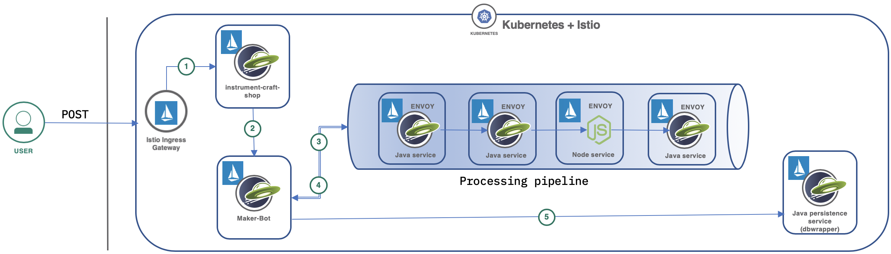
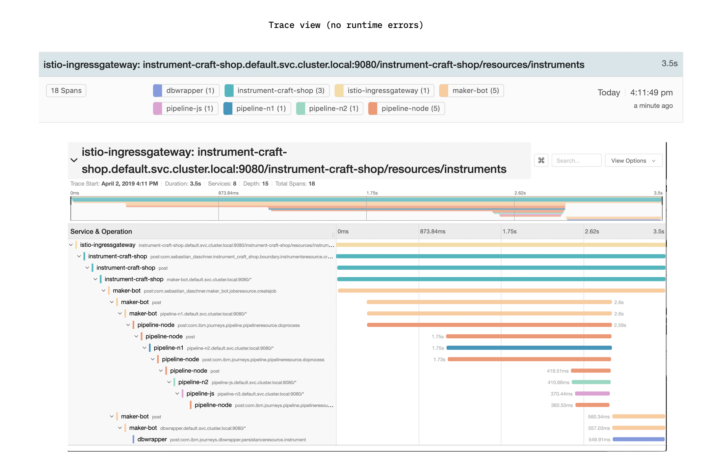
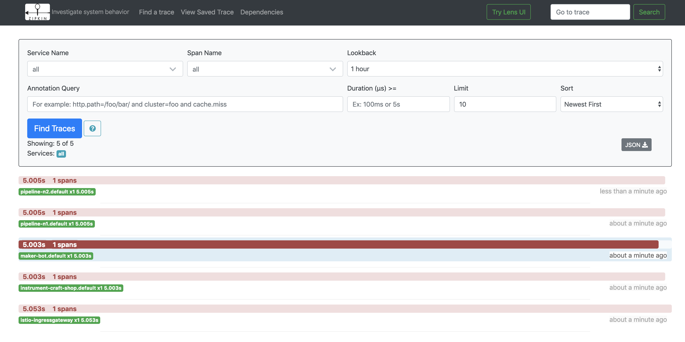
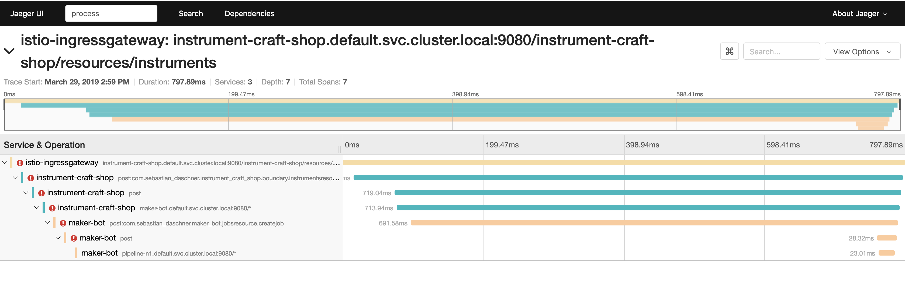
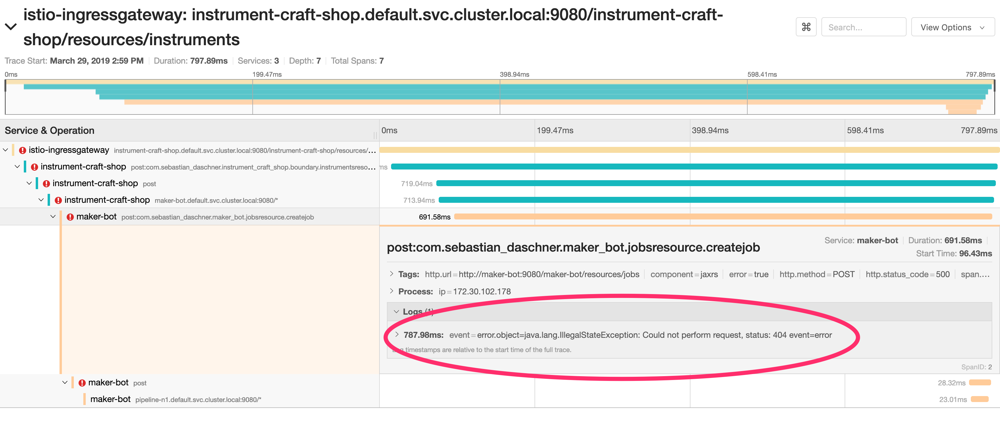

[](https://travis-ci.org/IBM/troubleshoot-with-openrtracing-and-istio)


# Use Distributed Tracing and OpenTracing in Istio to aid in microsorvice deployment troubleshooting

The movement toward microservice architectures has grown hand in hand with the growth of the public cloud. The two trends work together to allow organizations to neatly divide functionality. This helps with scale software function and engineering teams, as individual functions can be built and deployed independently into a container orchesteration system that manages many infrastructure issues with relative ease. 


[Istio](https://istio.io/), a joint collaboration between IBM, Google and Lyft provides an easy way to create a service mesh that will manage many of these complex tasks automatically, without the need to modify the microservices themselves. Istio does this by:

## Included Components
- [Istio](https://istio.io/)
- [IBM Cloud Kubernetes Service](https://console.ng.bluemix.net/docs/containers/cs_ov.html#cs_ov)
- [Jaeger](https://www.jaegertracing.io/)

# Prerequisite
Create a Kubernetes cluster with either [Minikube](https://kubernetes.io/docs/getting-started-guides/minikube) for local testing, with [IBM Cloud Private](https://github.com/IBM/deploy-ibm-cloud-private/blob/master/README.md), or with [IBM Cloud Kubernetes Service](https://console.ng.bluemix.net/docs/containers/cs_ov.html#cs_ov) to deploy in cloud. The code here is regularly tested against IBM Cloud Kubernetes Service using Travis.

Create a working directory to clone this repo and to download Istio into:

```bash
$ mkdir ibm
$ cd ibm
$ git clone https://github.com/IBM/opentracing-istio-troubleshooting 
```

You will also need Istio service mesh installed on top of your Kubernetes cluster.
Here are the steps (Make sure to change the version to your downloaded one):

```bash
$ curl -L https://git.io/getLatestIstio | sh -
$ mv istio-<version> istio # replace with version downloaded
$ export PATH=$PWD/istio/bin:$PATH
$ kubectl apply -f istio/install/kubernetes/istio-demo.yaml

```


Istio mesh promises to add observability to the complex task of microservice deployments. Although Istio simplifies some aspects, the added function is not completely "free" in the sense that, as we'll see,
an application inside the mesh does need to do some extra work to propagage request context through the mesh. However, OpenTracing support in Open Liberty reduces the cost of providing a mesh-wide view of distributed tracing. 
It allows basic support for distributed tracing without making any code changes. As a baseline, Istio must be installed with tracing enabled and, for the purposes of this demo, the sampling frequencing will be increased from the default 1% to something higher so we can see more frequent traces. The question here is, what do we learn without touching the code? 

One of the perhaps confusing areas of Istio is whether and how much an application has to be changed to advantage of the distributed tracing support.  If you install the standard "Bookinfo" application, you will find that requests are traced and visible in Zipkin or Jaeger.  However, each part of the app (links here) has code to capture and propagate context across calls to enable linking of calls along requests (Documentation)  https://istio.io/docs/tasks/telemetry/distributed-tracing/#understanding-what-happened. As you will notice in the Bookinfo app, manually handling context propagation for the purposes of tracing is tedious, and more importantly, it's easy to make an omission and leave the headers out of a REST call, creating gaps in the trace record. This is where Liberty microprofile comes in. When using JAX-RS REST client alongside microprofile OpenTracing, all context propagation is handled automatically. Developers of new services don't have any need for custom trace propagation code.  Global automatic propogation removes the opportunity for a deveoloper to forget to include instrumentation, thus causing gaps in the tracing data.

In this pattern we walk through a way to do distributed tracing in a multi-service application most of the microservices are running OpenLiberty with Microprofile, a set of technologies intended to simplfy cloud-native deployments. We add a Node microservice not using OpenTracing to illustrate how the Istio mesh enhances observability in a polyglot environment and as an interesting contrast with OpenLiberty's code-free instrumentation of RPCs.  The sample application is extremely simple and has the smallest amount of code possible to demonstrate distributed tracing in the context of a service mesh. In a few places the application will throw synthetic exceptions to give us something to look for in the trace data. There is also simulated delay of operations to force some respoinses to take longer than others.  I want to emphasize that the app does not do any actual processing.

We'll walk through the process of these steps:

- Installing Istio with tracing enabled
- Add OpenTracing features on an OpenLiberty project
- run a simple microservice based application and explore what we can learn from distributed tracing UI (Jaeger)
- inject several different kinds of failures into the application and use distributed tracing to investigate the root cause.

# Architecture

The app is made up of six services:




After a user sends a POST call into the ingress gateway public IP address, that request flows through the sample app as follows:

1. The Istio ingress gateway forwards the request to the service registered under the `instrumennt-craft-shop` name.
2. The `instrumennt-craft-shop` service calls to the `maker-bot` service, which then:
3. kicks off the "processing pipeline", which consists of four steps, each running in a separate pod.
4. the `maker-bot` service waits for the entire pipeline to complete.
5. If the pipeline completes, the final step in the sequence is a call from the `maker-bot` to the `dbwrapper` service, which, in a real service could persist the object to a database, but in our case sleeps for a short period of time before returning a response.

The processing pipeline represents any service with multiple steps (e.g. ETL workflow) to allow us to show the value of using distributed tracing in such an architecture. The sample app does not actually do any data processing, of course, since it exists to create a source of (occasional) error conditions that we can view in a trace.   Anyone who has worked with an architecture that could remotely be described as microservice will be familiar with the experience of seeing failure or sub-optimal performance and wondering what the root cause could be.  For simplicity, the service flow is synchronous. 

# Green path through application - no errors

Let's take a look at one succesfull request.

First, let's get the external IP and port of the ingress gateway:

```
$  kubectl get svc -n istio-system istio-ingressgateway
NAME                   TYPE           CLUSTER-IP       EXTERNAL-IP     PORT(S)                                                                                                                   AGE
istio-ingressgateway   LoadBalancer   172.21.158.107   169.55.65.202   80:31380/TCP,443:31390/TCP,31400:31400/TCP,15011:31315/TCP,8060:31977/TCP,853:31762/TCP,15030:30709/TCP,15031:31912/TCP   26d
```

Then, we'll make a single REST call to our service via the ingress IP/port:

`curl 169.55.65.202:31380/instrument-craft-shop/resources/instruments -i -XPOST -H 'count: 1'  -H 'Content-Type: application/json' -d '{"type":"GUITAR", "price":200}'`


Heading over to the dashboard, we'll see a trace that looks like this. Notice that we see the total time for the request (3.5s) and have separate spans for work done in each service.  Because both Microprofile OpenTracing and the Envoy proxy (sidecar container) are sending traces to the collector, spans for both show up and are nearly identical in length, as the proxy adds very little latency to each call. (Since the JAX-RS integration with Microprofile OpenTracing propogates the `x-b3-traceid` header value across network calls, the trace collector is able to combine information from both services.  This is also the reason our Node service (`pipeline-js` in the diagram here) is made part of this collection: even though it's not using an OpenTracing (or any tracing library) for that matter, we're able to see the request to the Node service in the flow of the due to the mpOpenTracing automatically propogating HTTP headers across calls. 



# Microprofile Open Tracing vs. manual context propogation:

Without a tracing library, headers in the Node service need to be copied from input to output to maintain the unified trace context:


```javascript
    var b3headers = ["x-b3-traceid",
	                 "x-b3-spanid",
					 "x-b3-sampled",
					 "x-b3-parentspanid"];
    axios.defaults.headers.post = {};
    b3headers.forEach(function(hdr) {
        var value = req.headers[hdr];
        if (value) {
            axios.defaults.headers.post[hdr] = value;
        }
      });
```

When viewed in Jaeger or Zipkin, the Node service is still visible among the Java applications, since the Envoy side-car is able to report the traceid to the collector, which will place it in context of other services. The headers are available in the Node service thanks mpOpenTracing, which automatically instruments HTTP calls made with the JAX-RS client. Every time a network call is made, these headers must be propogated, either manually or through a library that wraps network calls.

OpenLiberty changes to enable context propagation:

- server.xml
- Dockerfile
- pom.xml

Any code making REST calls will automatically have spans recorded.

# Load testing with Artillery


# Failure scenarios that we'll explore with distributed tracing

- Slow performance
- network timeouts
- service not started
- incorrect URLs
- NPE and other exceptions during operation

Now, the `x-request-id` value is injected by Istio header can be forwarded as well, but if untouched I find it helpful if logging it to have a correlation id to tie into individual requests, as tracing does not record detailed error data, for that, you would need to fall back to your log aggregation service (link to LogDNA in IBM cloud)

https://www.envoyproxy.io/docs/envoy/latest/intro/arch_overview/tracing#arch-overview-tracing


Here I want to discuss a specific use case for distributed tracing. Let's take a look at a simple microservice based sample app and if we can discover problems. In the app, basd on a demo app called "instrument-craft-shop" it simulates an interface to a manufacturing facility. But the details are not important for the demonstration. The key here is that it's an application whose function is distributed across several microservices, each on running in an OpenLiberty container. 


Steps
Installation of Istio (TBD)


Let's run a load tester against the app and see what we can learn from the story through distributed tracing.

Artillery [ link to artillery here ]

Hint: Because the traces don't retain information about path parameters or payload bodies, separating REST operations by URL helps to identify what was going on by quickly glancing at the trace UI.

No tracing
-------------



Scenarios:
-----------

1. Service not yet started:
------------------------

To begin with, we'll look at a relatively simple situation: service is unavailable.
In a microservice environment, sometimes, a service isn't ready, or has failed for some purpose. Another service attempting to call this service will get an error.  This jumps out immediately in the distributed tracing
system as some services just don't appear.  In this case, a pipeline node did not complete its startup and the web application was not ready to receive requests.  We can see it's missing from the trace entirely and if we dig deeper we find a "404" message in the maker-bot:





# Steps

# References
[Istio.io](https://istio.io/docs/tasks/)
# License
[Apache 2.0](http://www.apache.org/licenses/LICENSE-2.0)
